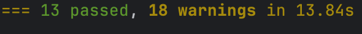

Testing Methodology
==================

To test cupboardy we decided to implement unit tests with pytest, this is a good way to prove the functionality of our project.
We devised tests which test both the functionality of the login, inventory and shopping list systems both with normal access
as well as misuse, such as accessing the inventory page without first logging in.

These tests can be run by runnning ```pytest``` in the terminal at the project root.

Results of the tests written
=====



Our code passed all tests flawlessly, the warning are simply due to our use of Query.get() as opposed to Session.get(), 
this hasn't limited or broken the application in any way.

